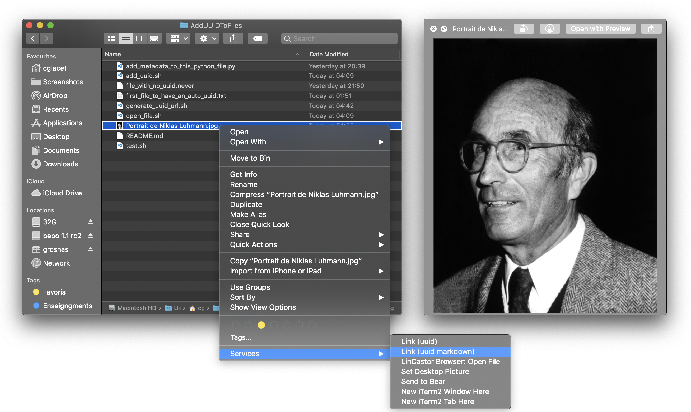
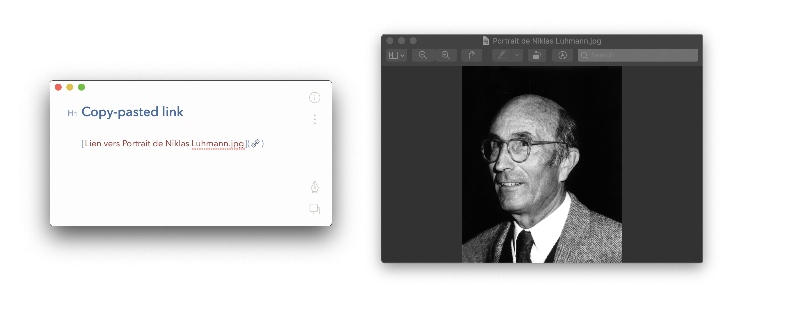
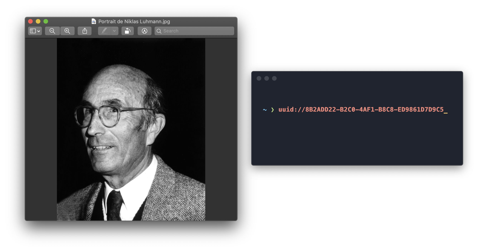
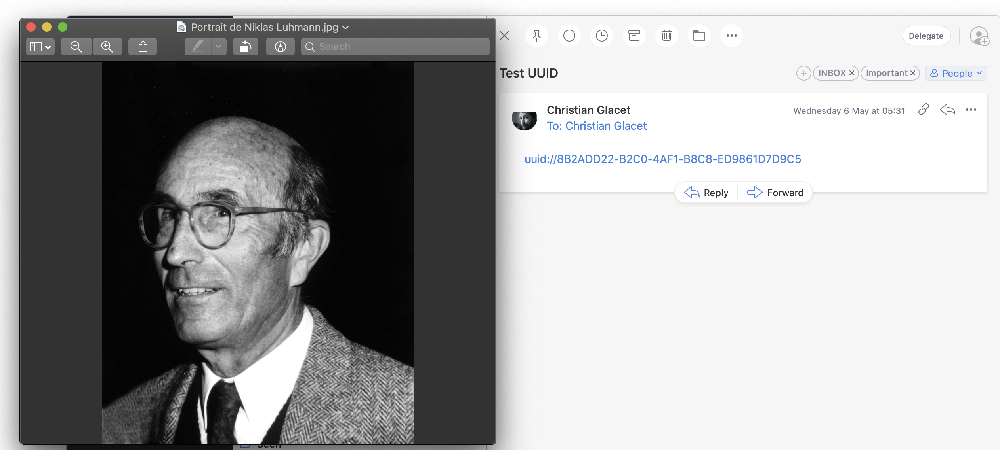

# Get universal link to any of your file using the UUID-scheme

Create permanent links to any file on your Mac so you never have dead links in your notes anymore. Links created using this mechanism can be used pretty much anywhere in your Mac applications.

Every file will be opened with the default application for its type ([set the default application](https://www.techjunkie.com/default-applications-macos/)).

## Installation

In a terminal :

```bash
/bin/bash -c "$(curl -fsSL https://raw.githubusercontent.com/cglacet/uuid-scheme/master/install.sh)"
```

## Example of usage

Find the file you want to reference and copy a link to it (either markdown, or plain text link): 
<div align="center"></div>

Then paste it anywhere, say for example in your prefered note editor — I love [Bear notes][Bear.app] but this would work in any markdown compatible application (or at least it should — [][Bear.app] [][Ulysses.app] [][Simplenote.app] [][Evernote.app]):
<div align="center"></div>

If you copy the plain text link, you would endup with something like: `uuid://8B2ADD22-B2C0-4AF1-B8C8-ED9861D7D9C5`. 
If this link appear anywhere on your mac where URI are interpreted by the OS, you should be able to click it to open the file whose UUID is *8B2ADD22-B2C0-4AF1-B8C8-ED9861D7D9C5*. For example in a terminal:

<div align="center"></div>

Or in mails ([Spark][Spark.app]):

<div align="center"></div>

## Related repositories 

* Add [backreferences to bear notes](https://github.com/cglacet/bear)

[Bear.app]: https://bear.app/
[Spark.app]: https://sparkmailapp.com/
[Ulysses.app]: https://ulysses.app/
[Simplenote.app]: https://simplenote.com/
[Evernote.app]: https://evernote.com/
